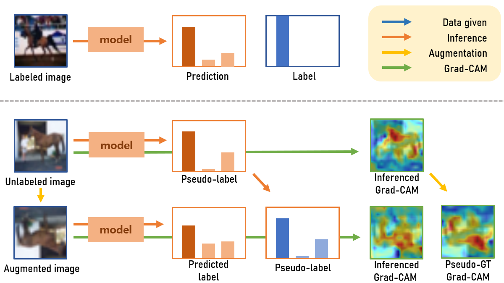
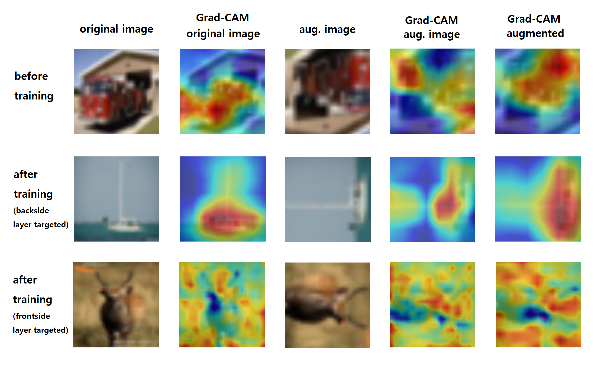
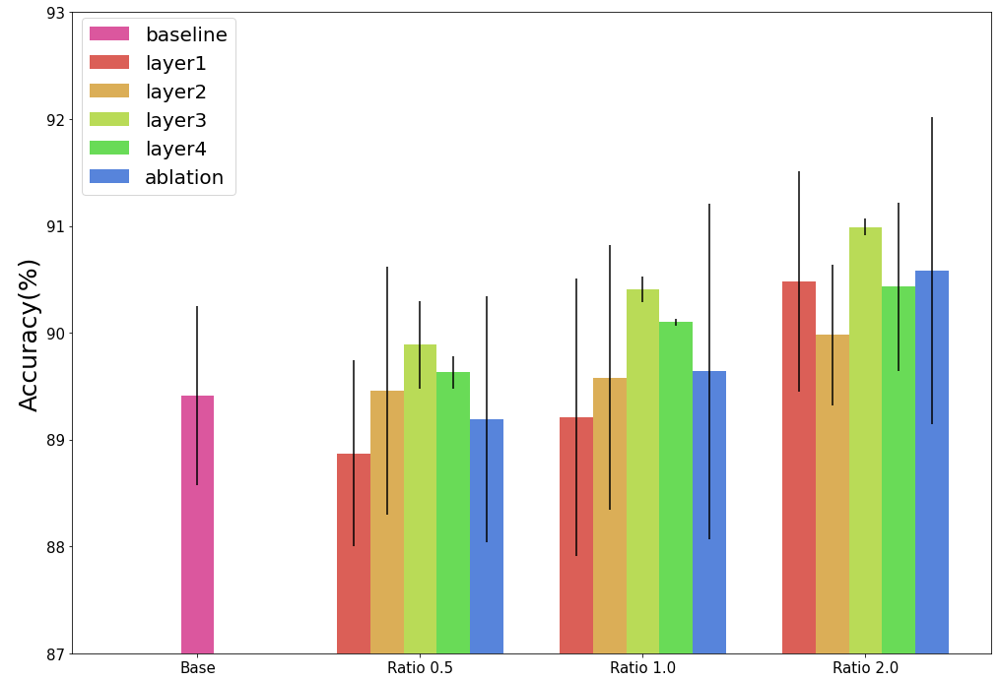

# Semi-supervised Image Classification with Grad-CAM Consistency

## Installation
- environment
```
- Windows10
- nvidia-dirver 461.72
- cuda 11.1
- cuDNN 8.0.5
- pytorch 1.7.1
```
- installation 
```
git clone <url_repo> <dir_name>
conda create -n <env_name> python=3.8
conda activate <env_name> 
conda install pytorch torchvision cudatoolkit=11.0 -c pytorch
pip install -r requirements.txt
```

## Basic information about framework
- backbone network : ResNet50
- augmentation : crop & rotation (& color jitter)
- consistency : Grad-CAM (+ prediction label)

## Datasets
- DL20: https://www.kaggle.com/c/postech-classification
- Cifar10: https://www.cs.toronto.edu/~kriz/cifar.html

## Demo
- Overview


- Difference on GradCAM


- Validation test statistics



## Contributors
이주용 gimme1dollar         
조승혁 shhj1998         
권동현 kinux98        
