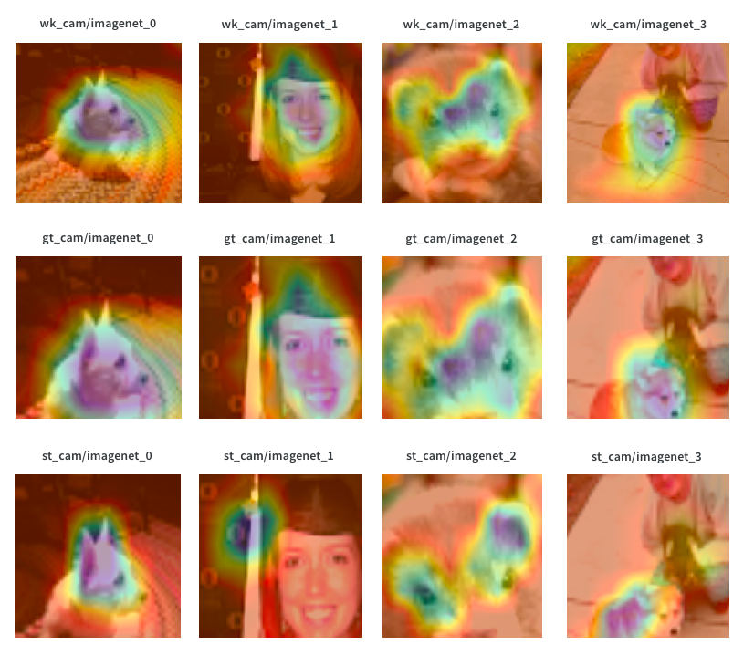

# Semi-supervised Image Classification with Grad-CAM Consistency

## Basic information about framework
- backbone network : efficientnet-b04 
- augmentation : color jitter & crop & rotation
- consistency : prediction label & grad-CAM 

## Datasets
- DL20: https://www.kaggle.com/c/postech-classification
- Cifar10: https://www.cs.toronto.edu/~kriz/cifar.html

## Demo
- Difference on GradCAM

## Contributors
이주용 gimme1dollar       
권동현 kinux98
조승혁 shhj1998
